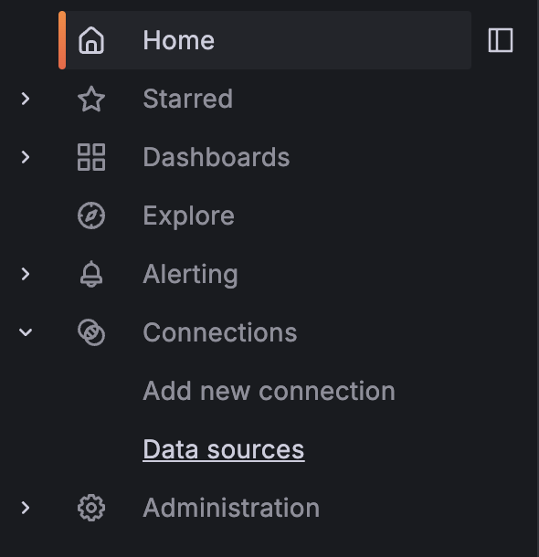
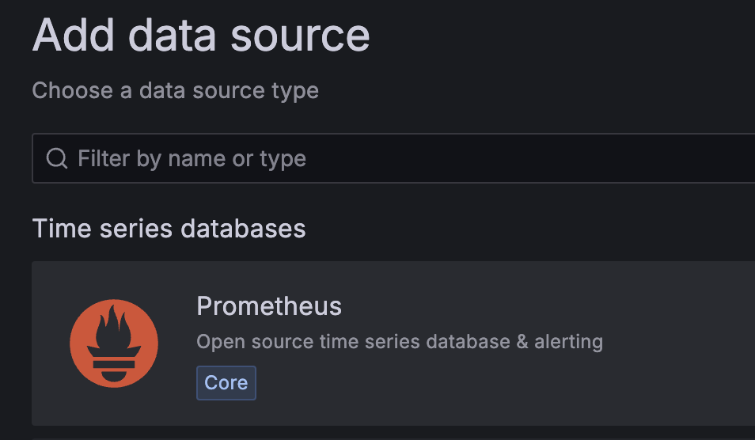
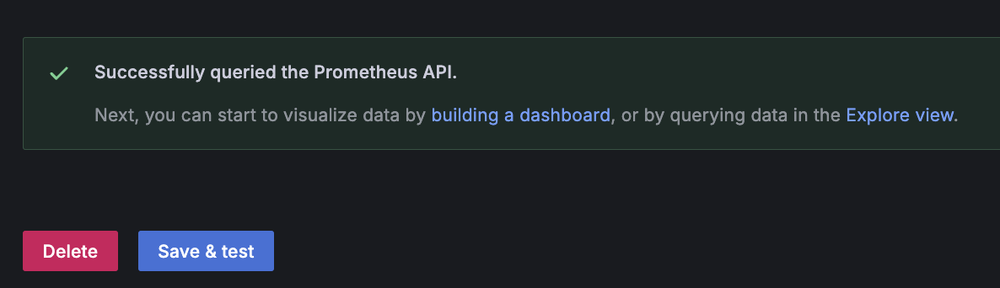

# Step 3: Provisioning our Prometheus datasource
Now that we have our Grafana and Prometheus services running, we need to configure Grafana to use Prometheus as a data source. This will allow us to visualize the metrics collected by Prometheus in Grafana. We will show you two methods to do this: using the Grafana UI and using a provisioning file. 

***Note:*** *The provisioning file method will simply move the precreated config file and restart the Grafana service. This is the the fastest method for this demo if you would like to get straight to visulization*

## Method 1: Using the Grafana UI
1. Open your browser and go to the Grafana UI by clicking on the following link: **[http://localhost:3000]({{TRAFFIC_HOST1_3000}})**

2. Sign in with the following credentials:
   - **Username:** admin
   - **Password:** admin
  
3. Once logged in, open the left hand side menu, then click on **Connections -> Data Sources**.


4. Click on the **Add data source** button.

5. Select **Prometheus** from the list of data sources.


6. In the **Connection** section, set the following fields:
   - **Prometheus server URL:** `http://localhost:9090`

7. Click on the **Save & Test** button to save the data source and test the connection to Prometheus.


You have now successfully configured Grafana to use Prometheus as a data source. You can now start creating dashboards to visualize the metrics collected by Prometheus.

## Method 2: Using a Provisioning File
1. We have already created a provisioning file for you. We will move this file to the correct location and restart the Grafana service. Run the following command to do this:
   ```
   sudo cp /education/prometheus_datasource.yaml /etc/grafana/provisioning/datasources/ && sudo systemctl restart grafana-server
   ```{{execute}}