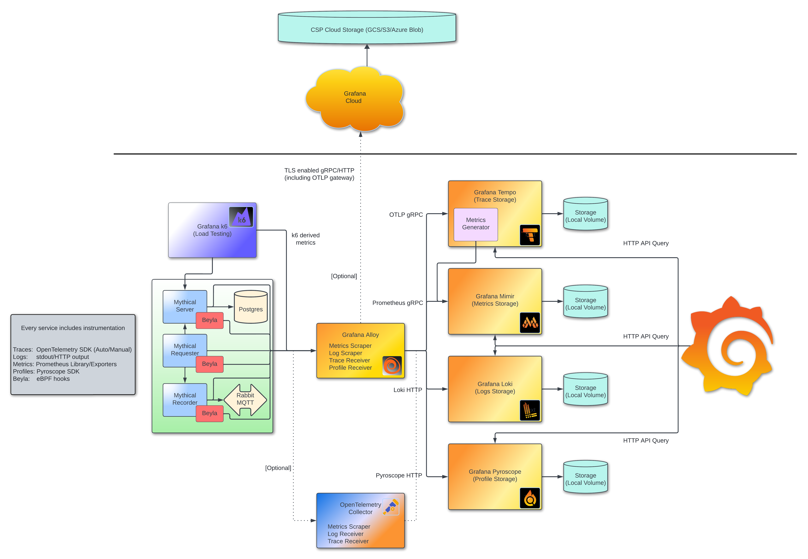

# Introduction to Metrics, Logs, Traces and Profiles in Grafana
 ***Note:** This is sandbox enviroment for the [Intro to MLTP project](https://github.com/grafana/intro-to-mltp/blob/main/README.md). Please make sure to consult the full README.*

**Grafana Beyla is also not available within this online sandbox since it requires kernal version: 5.8. Please run the project locally to view the Beyla part of the demo**



## History

This was originally the  companion repository to a series of presentations over the [three pillars of
observability within Grafana](https://grafana.com/blog/2022/04/01/get-started-with-metrics-logs-and-traces-in-our-new-grafana-labs-asia-pacific-webinar-series/). Whilst that series is now over a year old, we have kept this repository up-to-date with the latest versions of our products and added more functionality as our products have grown.

It is presented as a self-enclosed Docker sandbox that includes all of the components required to run on a local machine and experiment with the products provided.

Since the original series, this repository has seen its use grow. Whilst we still highly recommend everyone to sign up for a Grafana Cloud account, this repository exists as an easy way to get started with Grafana's offerings in a non-cloud, local-based setup. In addition, you can use this setup to experiment with configuration settings on those offerings.

You can also send data from the example microservice application to Grafana Cloud products.

## Overview
The demos from this series were based on the application and code in this repository, which includes:

* Docker Compose manifest for easy setup.
* Four-service application:
  * A service requesting data from a REST API server.
  * A REST API server that receives requests and utilises a Database for storing/retrieving data for those requests.
  * A recorder service for storing messages to an AMQP bus.
  * A Postgres Database for storing/retrieving data from.
* k6 service running a load test against the above application.
* Tempo service for storing and querying trace information.
* Loki service for storing and querying log information.
* Mimir service for storing and querying metric information.
* Pyroscope service for storing and querying profiling information.
* Beyla services for watching the four-service application and automatically generating signals.
* Grafana service for visualising observability data.
* Grafana Alloy service for receiving traces and producing metrics and logs based on these traces.
* A Node Exporter service to retrieve resource metrics from the local host.

## Housekeeping

This environment runs an install script on startup automatically. Your training environment is ready to go once you see:

```bash

```

Continue to the next step to find the tutorial environment navigation URLs.

## Reporting Issues
If you encounter any issues with the environment, please report them to the [GitHub repository](https://github.com/grafana/killercoda)