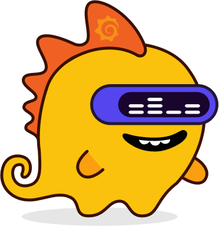

# Congratulations!

You have completed the interactive scenario on Frontend Observability with Grafana Faro. Thank you for participating!

## In This Course, You Learned:

- **Setting Up Grafana Faro**: How to configure and initialize Grafana Faro within your Grafana Cloud instance to start collecting data from a frontend application.
- **Instrumenting a React Application**: The steps to integrate Grafana Faro into a React application to track and collect metrics, logs, and user interactions.
- **Visualizing Data**: How to use the powerful visualization capabilities of Grafana to explore and analyze data collected by Grafana Faro.
- **Real User Monitoring (RUM)**: The benefits of RUM to gain insights into how real users interact with your application.
- **Analyzing Performance Issues**: Techniques to identify and troubleshoot common performance issues using the data provided by Grafana Faro.

## What's Next?

Now that you have a solid foundation in frontend observability with Grafana Faro, here are a few recommendations on what to do next:

1. **Deepen Your Knowledge**:
   - Continue exploring other features of Grafana Faro. There is much more to learn about customizing your observability setup.
   - [Grafana Faro Documentation](https://grafana.com/docs/grafana-cloud/monitor-applications/frontend-observability/)
   
2. **Apply What You've Learned**:
   - Apply the techniques learned in this scenario to your personal or work projects. Start with simple setups and gradually incorporate more complex monitoring and visualization techniques.

3. **Join the Community**:
   - Connect with other Grafana users and contributors in the [Grafana Community](https://community.grafana.com/). It’s a great place to share ideas, solve problems, and get updates about new features and best practices.

4. **Expand Your Skill Set**:
   - Consider learning more about app observability with Grafana, which can complement the skills you've gained in this course.
   - Explore other Grafana products and plugins that can enhance your monitoring solutions.

We hope you found this scenario both informative and enjoyable. Your feedback is valuable to us, so please let us know how we can improve this and future courses. Keep learning and monitoring, and see you in the next scenario!

